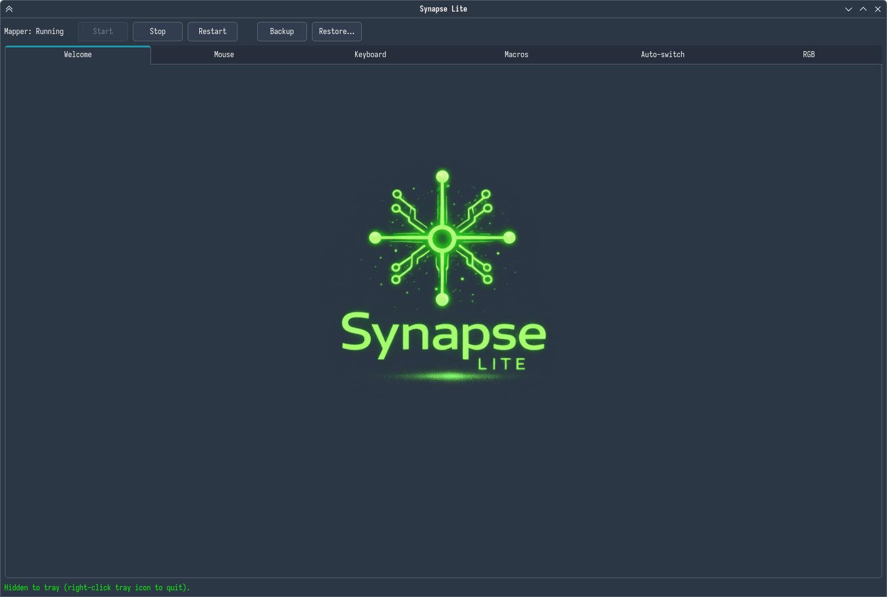
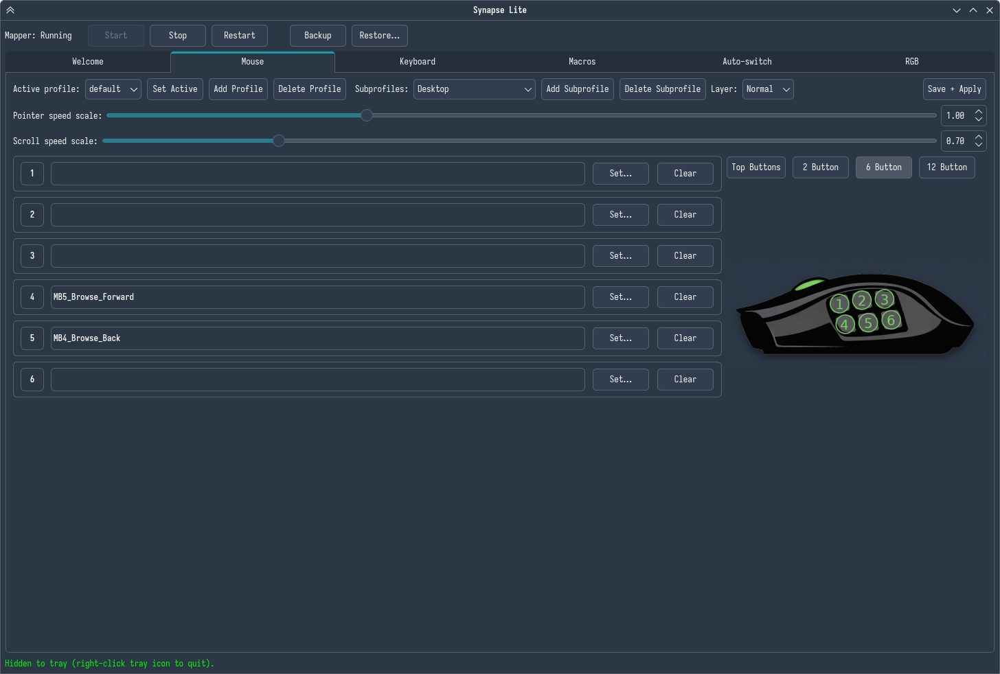
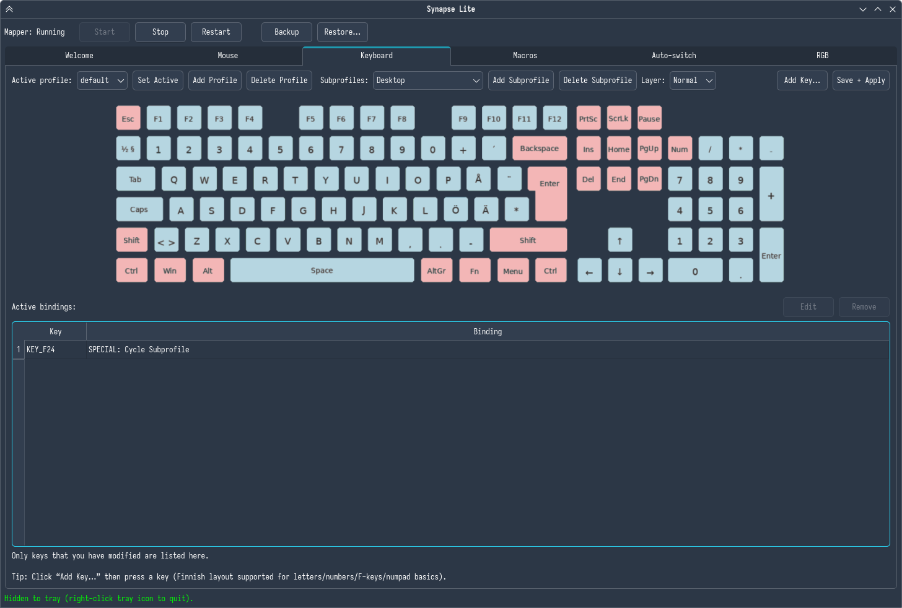
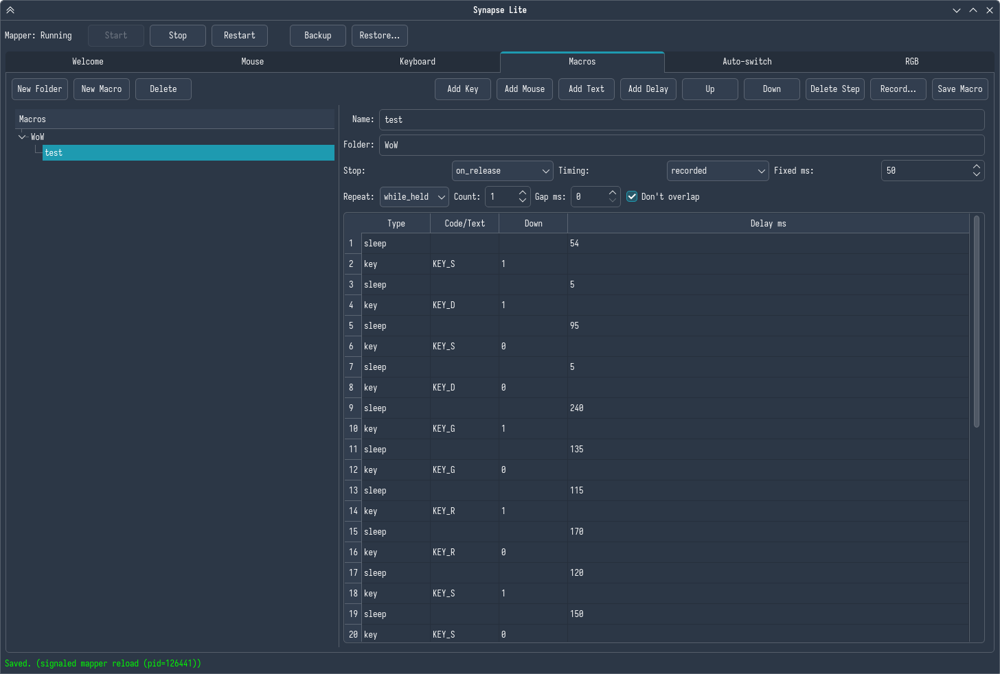
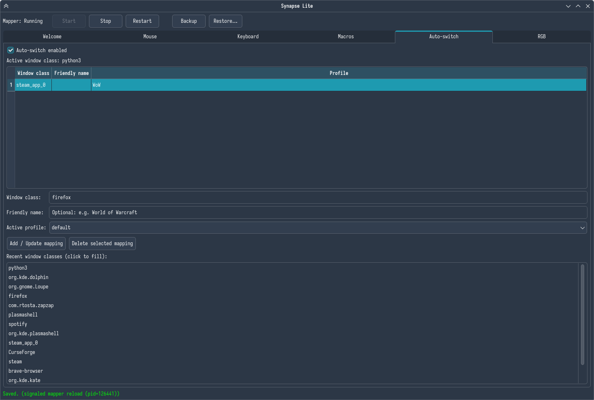
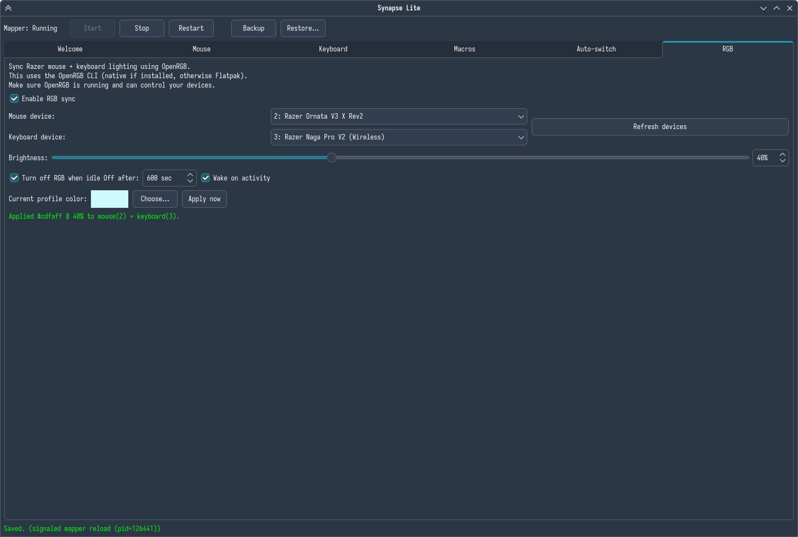

# Synapse Lite (Linux)

Synapse Lite is a lightweight, Linux replacement for Synapse-style mouse software.  
It runs a **mapper daemon** (evdev → uinput) plus a **GUI editor** for profiles, bindings, and macros.

**Highlights**
- Device detection (Razer Naga V2 Pro tested)
- Layered bindings with non-interfering precedence: **Shift → Ctrl → Alt → Normal**
- Macro engine (repeat/stop modes + overlap prevention + stuck-key safety)
- GUI editor for profiles / bindings / macros
- Per-profile persistence
- **Global hotkey support** (ships with `KEY_F24 → cycle_subprofile` by default) - This is only for Naga users, pressing the bottom button cycles subprofiles you have saved.

---








## Dependencies

### Required
- Python 3
- systemd user services (`systemctl --user`)
- Linux input + uinput access (`/dev/input/event*`, `/dev/uinput`)
- Openrgb

### Optional
- `kdotool` (only needed for autoswitch / active window polling on KDE/Wayland)

---

## Install dependencies

## Ubuntu / Debian

### Python 3
```bash
sudo apt update
sudo apt install -y python3 python3-venv
```

### Kdotool
```bash
sudo apt install -y cargo
cargo install kdotool
~/.cargo/bin/kdotool --help
```

## Fedora

### Python 3 + kdotool
```bash
sudo dnf install -y python3 kdotool
```

## Arch / Manjaro

### Python3
```bash
sudo pacman -S --needed python
```

### Kdotool via AUR
```bash
yay -S kdotool
# or: paru -S kdotool
```

### Manjaro — Kdotool via Cargo
```bash
sudo pacman -S --needed rust cargo
cargo install kdotool
```

## Input permissions

### Option A (recommended) — Step 1 - udev rule
```bash
sudo tee /etc/udev/rules.d/99-synapse-lite.rules >/dev/null <<'EOF'
# Allow access to uinput for user-space virtual devices
KERNEL=="uinput", MODE="0660", GROUP="input", OPTIONS+="static_node=uinput"
# Broad rule: allow read access to event devices.
# For tighter rules, restrict by vendor/product.
KERNEL=="event*", SUBSYSTEM=="input", MODE="0660", GROUP="input"
EOF
```

### Option A — Step 2 - reload udev rules
```bash
sudo udevadm control --reload-rules
sudo udevadm trigger
```

### Option B — Step 1 - add user to input group
```bash
sudo usermod -aG input "$USER"
```

### Option B — Step 2 - log out/in check
```bash
groups | grep -q input && echo "OK: in input group" || echo "Not in input group"
```

## OpenRGB install (recommended: Flatpak, works on most distros)

Install Flatpak (if you don’t have it)
### Ubuntu/Debian:
```bash
sudo apt update && sudo apt install -y flatpak
```

### Fedora:
```bash
sudo dnf install -y flatpak
```

### Arch:
```bash
sudo pacman -S --needed flatpak
```

### Add Flathub + install OpenRGB
```bash
flatpak remote-add --if-not-exists flathub https://flathub.org/repo/flathub.flatpakrepo
flatpak install -y flathub org.openrgb.OpenRGB
```

### Run
```bash
flatpak run org.openrgb.OpenRGB
```

## OpenRGB install (native packages)

### Fedora
```bash
sudo dnf install -y openrgb
openrgb
```

### Arch Linux
```bash
sudo pacman -S --needed openrgb
openrgb
```

### Ubuntu / Debian (native)
Availability varies by release; if apt doesn’t have a recent version, prefer Flatpak above. (Flatpak is the most reliable “it just works” path on Ubuntu/Debian.)

### Common post-install step: permissions (udev rules)
If OpenRGB opens but devices don’t show up / you get permission errors, it’s almost always missing udev permissions for HID/USB.
A safe “generic” starting point is to install OpenRGB’s udev rules (many installs include a helper script or packaged rules).

### Install Synapse Lite

### Install (recommended) From the folder.
```bash
chmod +x install.sh
./install.sh
```

### Service status / restart / logs
```bash
systemctl --user status synapse-lite.service --no-pager
systemctl --user restart synapse-lite.service
journalctl --user -u synapse-lite.service -n 120 --no-pager
```

### Launch GUI
```bash
python3 ~/.local/share/synapse-lite/synapse_lite_gui.py
```
